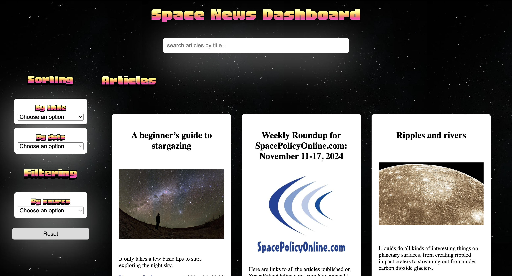

# Space News Dashboard

Space News Dashboard is a dashboard that brings together space news from all over. Think of it as your personal space news headquarters, where you can actually find what you're looking for without drowning in clickbait or having to visit 20 different websites.

## Features

+ Sorting/searching news by title 
+ Filtering news by categories 
+ Pagination(max 30 news on each page)


## Website design 


## Installation

Open up your terminal and run this command 
```bash
git clone https://github.com/amanbolsyn/Space-News-Dashboard.git
```

After cloning is finished run this command
```bash
cd Space-News-Dashboard/
```

There to ways of running task-planner locally
1. Running it using Live Server(VS code extension)
2. Or run this command on your terminal instead

```bash
python3 -m http.server 8000
```

Live server will open up the browser window automatically. The second way will provide you the link on your terminal that you have to follow. Unfortunately, the application doesn't work on Safari(working on it). 

Congratulations you installed my application. Hopefully you will be able to enjoy it. 

## Possible improvements 

+ Responsive desgin for tablets and smartphones
+ Improve pagination by adding page numbers. In which page the user is currently on.
+ Toggle between infinate scroll and pagination 
+ Add list or column view toggles 
+ Clicking news card should show its full details
+ Add animations 
+ Featching news from an API 
+ Add loading states for data fetching
+ Include error handling for failed requests
+ Add "no news to display" if there is no news 

 
## Bugs 

+ Search, sorting, filtering algorithm doesn't work properly. 
+ Categories in filtering are hardcoded. Change it so that values for filtering will be dynamically updated with acutal existing category names.

## Resources 

+ [Project by Alem School](https://alem.school)
+ [Terms of reference](https://github.com/alem-platform/sprint-js/tree/main/crunch02)

## Contributing

Pull requests are welcome. For major changes, please open an issue first
to discuss what you would like to change.

## License

Cannot be used for commercial purposes.

